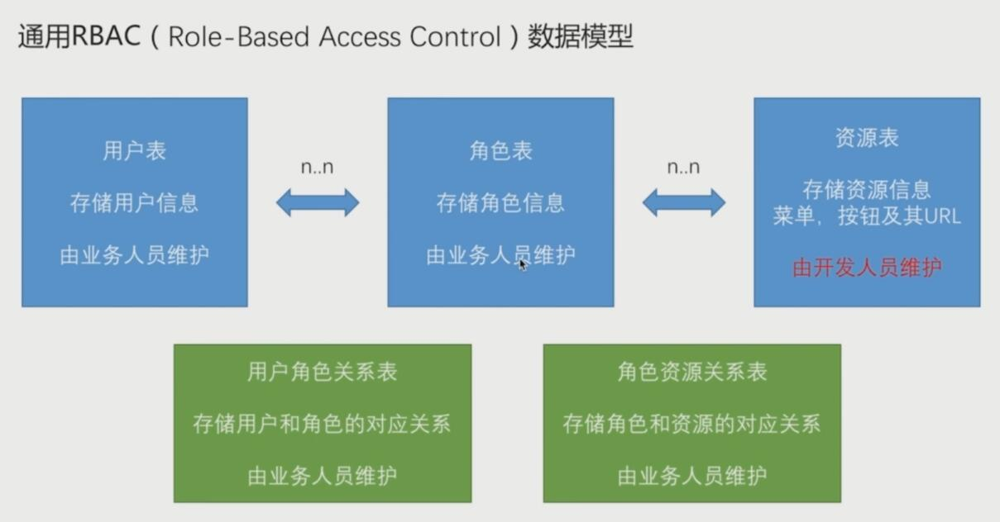

= lesson-cloud-auth Guide
EchoCow <lizhongyue248@163.com>
v1.0, 2019-4-22
:toc: right

== lesson-cloud-auth

为了让大家更加清晰的清晰的了解我们系统的授权模块，所以写这么一个文档，方便大家阅读以及理解代码。

== 在这之前

你需要了解授权模块核心的几张表

[cols="1,1,3", options="header"]
.核心表
|===
| 表名 | 名称 | 描述

| sys_user
| 用户表
| 存放核心用户信息

| sys_role
| 角色表
| 存放用户角色信息

| sys_res
| 资源表
| 存放所有访问的资源

| sys_user_role
| 用户角色关联表
| 多对多关系，一个用户可有多个角色，一个角色可有多个用户，使用 id 进行关联

| sys_role_res
| 角色资源管理表
| 多对多关系，一个角色可管理多个资源，一个资源可被多个角色管理，使用 id 进行关联
|===

设计采用 rbac 模型进行设计，他们之间的关系如下

[[img-sunset]]

对于 rbac 模型来说，最为重要的就是角色表，存储用户角色信息，以及资源的控制都是由角色表来控制。所以我们需要做的就是根据角色进行授权。

- 业务人员指的是管理员之类的，可以直接通过 web 进行浏览与修改的。
- 开发人员指的是开发后台的人。

所以业务人员可以根据需求对用户、角色以及他们的关系进行控制，但是对于资源表，只有开发者知道自己开发的有哪些组件以及内容，所以需要由开发者维护。

当然，为了设计的灵活性，我在设计的时候引入了动态权限控制，后面具体再说。

=== 用户表

这个表是存放所有用户信息的，包括用户名称、手机号、邮箱、密码等这些。是登录认证的核心表，他与角色多对多关联。举个例子：

1. 小明是一个教师，同时他又是系统的管理员，那么他就要应该有两个角色，分别是管理员和教师
2. 同样，管理员可以有很多个用户，比如小明是管理员，小花也是管理员

用户与角色的关联关系由 sys_user_role 控制

=== 角色表

这个表是存放所有角色信息的，包括角色名字、图标等，在用户登录成功后，我们会赋予它相应的角色，他与用户表和资源表多对多关联，举个例子：

1. 管理员角色可以查看所有用户信息，同时他可以查看所有日志信息，那么就有两个资源的操作权限，分别是用户查看，日志查看
2. 同样，一个资源可以被多个角色操纵，比如日志信息，可以让老师和管理员都可以看见

角色与资源的关联关系由 sys_role_res 控制

目前写死的几个角色如下：

[cols="1,3", options="header"]
|===
|角色名称 | 描述

|ROLE_ADMIN
|管理员角色，当用户有管理员角色的时候，开放所有资源，只用与用户表关联。

|ROLE_NO_AUTH
|不可访问角色，如果此资源拥有此角色，那么直接禁止访问，只用与资源表进行关联。

|ROLE_PUBLIC
|公共资源，当资源与此角色关联的时候，无需认证直接访问，只用于资源表进行关联。
|===

以上角色为在程序中写死的，默认的角色。当有新增的角色的时候，需要其与用户、资源表进行关联。

=== 资源表

这个表是存放所有访问所有对外提供访问的资源，只要是可以请求道的资源都要在这里面进行定义，对于后端来说，核心的是 match_url 与 method 两个字段。举个例子：

1. 现在日志管理是 /sysLogs，我想要所有人能够访问日志管理，必须在资源表中添加对应的 match_url 路径匹配，然后 method 进行方法匹配，接着在角色和资源的关联表中添加允许访问的角色关联。
2. 那么操作应该是在 sys_res 加入一条数据，match_url 为 /sysLogs，method 为 GET
3. 然后在 sys_role_res 中加入一条数据，我希望 它能够被所有人访问，不需要登录，那么此时 需要在角色表中找到 ROLE_PUBLIC 的 id，在 sys_res 找到刚才插入的 sysLogs 的 id，然后分别填入到 sys_role_res 的 role_id 和 res_id 字段。
4. 测试即可。

资源表必须由开发人员维护，因为对于整个系统的所有可访问的路径，都是由开发者进行开发的。

== 结构介绍

先来了解一下模块内的目录

[cols="1,1,2", options="header"]
.包
|===
| 包名 | 名称 | 描述

| cn.edu.gzmu.auth
| 授权模块
| 核心授权流程

| cn.edu.gzmu.auth.handler
| 处理器
| 对登录成功、失败进行处理

| cn.edu.gzmu.auth.res
| 资源授权
| 对资源进行方法级控制

| cn.edu.gzmu.auth.sms
| sms 授权
| 自定义 spring security oauth2 sms 授权

| cn.edu.gzmu.auth.user
| 用户处理
| 这里进行用户登录查询等操作

| cn.edu.gzmu.config
| 安全配置
| 关于安全的所有配置都在这里进行配置

| cn.edu.gzmu.config.oauth2
| oauth2 配置
| 包括授权服务器、资源服务器以及 token 配置

| cn.edu.gzmu.properties
| 配置参数
| 关于安全的配置参数

| cn.edu.gzmu.social
| 第三方登录配置
| 待完成

| cn.edu.gzmu.validate
| 验证码
| 各种验证码配置

| cn.edu.gzmu.UserController
| 安全信息
| 用户安全控制器
|===

== 认证

对于认证我们暂时提供两种认证方式，一种 密码认证，另外一种 手机验证码 认证方式。提供以下接口：

- `/code/sms` 获取手机验证码
- `/oauth/sms` 手机验证码认证
- `/oauth/token` 密码认证 与 刷新令牌
- `/oauth/check_token` 检查 token 信息

=== 密码认证

使用 spring security oauth2 提供的默认密码登录即可，请求接口如下：

- 请求路径：`/oauth/token`
- 请求方法： POST
- 请求头：

[cols="1,4,2", options="header"]
.请求头
|===
|参数 |值 | 描述
|Authorization
|Basic bGVzc29uLWNsb3VkOmxlc3Nvbi1jbG91ZC1zZWNyZXQ=
|来自于 oauth client id 和 client secret base64 加密
|===

- 请求参数：

[cols="1,1,2", options="header"]
.请求参数
|===
|参数 |值 | 描述

|grant_type
|password
|请求类型

|scope
|all
|请求权限域

|username
|-
|用户名

|password
|-
|密码
|===

- 正确响应：

[cols="1,1", options="header"]
.正确响应
|===
|属性 | 描述

|access_token
|jwt 加密后令牌

|token_type
|令牌类型，默认 bearer

|refresh_token
|用来刷新的令牌

|expires_in
|有效期

|scope
|请求域，默认 all

|jti
|JWT ID
|===

- 错误响应

[cols="1,2,2,2", options="header"]
.错误响应
|===
|状态码 |错误原因 |  错误(error) | 错误信息(error_message)

| 401
| 请求头中不含有 Authorization 属性
| unauthorized
| Full authentication is required to access this resource

| 400
| grant_type 参数错误
| unsupported_grant_type
| Unsupported grant type: ...

| 400
| scope 参数错误
| invalid_scope
| Invalid scope:...

| 400
| 用户名或密码错误
| invalid_grant
| 用户名或密码错误
|===

这里原理我就介绍了，是由 spring security oauth2 实现的，有兴趣可以去看看源码。他的核心是 `org.springframework.security.web.authentication.UsernamePasswordAuthenticationFilter` 这个过滤器。

=== 手机验证码认证

手机验证码认证分为两步，第一步为下发验证码，第二步为携带验证码和手机号请求认证。

==== 获取验证码

由于目前没有真正的手机提供商，所以我不会真正的发短信，但是会默认短信验证码为 1234 并存储到 redis 之中。

- 请求路径：`/code/sms`
- 请求方式： GET
- 请求头：

[cols="1,1,2", options="header"]
.请求头
|===
|参数 |值 | 描述
|sms
|-
|手机号
|===

- 请求参数： 无
- 正确响应：

[cols="1,1", options="header"]
.正确响应
|===
|状态码  |  响应体

| 200
| 无
|===

- 错误响应：

[cols="1,2,2,2", options="header"]
.错误响应
|===
|状态码 |错误原因 |  错误(error) | 错误信息(error_message)

| 401
| 请求头中不含有 sms 属性
| unauthorized
| 请求中不存在设备号
|===

==== 手机认证

- 请求路径：`/oauth/sms`
- 请求方式： POST
- 请求头：

[cols="1,4,2", options="header"]
.请求头
|===
|参数 |值 | 描述
|Authorization
|Basic bGVzc29uLWNsb3VkOmxlc3Nvbi1jbG91ZC1zZWNyZXQ=
|来自于 oauth client id 和 client secret base64 加密

| sms
| -
| 手机号
|===

- 请求体：

[cols="1,4,2", options="header"]
.请求头
|===
|参数 |值 | 描述
|sms
|-
|手机验证码
|===

- 正确响应：

[cols="1,1", options="header"]
.正确响应
|===
|属性 | 描述

|access_token
|jwt 加密后令牌

|token_type
|令牌类型，默认 bearer

|refresh_token
|用来刷新的令牌

|expires_in
|有效期

|scope
|请求域，默认 all

|jti
|JWT ID
|===

- 错误响应： 待封装

[cols="1,3,3,3", options="header"]
.错误响应
|===
|状态码 |错误原因 |  错误(error) | 错误信息(error_message)

| 400
| 请求体中不含有 sms 属性或者验证码验证失败
| 获取验证码失败，请重新发送
| 获取验证码失败，请重新发送

| 400
| 请求头中不含有 sms 属性
| 请求中不存在设备号
| 请求中不存在设备号
|===

==== 原理

获取手机验证码主要在 `cn.edu.gzmu.validate.sms` 下，具体请参见 `cn/edu/gzmu/validate/package-info.java`

手机验证主要在 `cn.edu.gzmu.auth.sms`，具体请参见 `cn/edu/gzmu/auth/sms/package-info.java`

== 其他

spring security oauth2 提供了其他路径进行帮助。

- `/oauth/token` 刷新令牌
- `/oauth/check_token` 检查 token 信息

=== 刷新令牌
- 请求路径：`/oauth/token`
- 请求方式： POST
- 请求头：

[cols="1,4,2", options="header"]
.请求头
|===
|参数 |值 | 描述
|Authorization
|Basic bGVzc29uLWNsb3VkOmxlc3Nvbi1jbG91ZC1zZWNyZXQ=
|来自于 oauth client id 和 client secret base64 加密
|===

- 请求体：

[cols="1,4,2", options="header"]
.请求头
|===
|参数 |值 | 描述
|grant_type
|refresh_token
|刷新验证码

|refresh_token
|-
|获取 token 时候得到的 refresh_token
|===

- 正确响应：

[cols="1,1", options="header"]
.正确响应
|===
|属性 | 描述

|access_token
|jwt 加密后令牌

|token_type
|令牌类型，默认 bearer

|refresh_token
|用来刷新的令牌

|expires_in
|有效期

|scope
|请求域，默认 all

|jti
|JWT ID
|===

- 错误响应：

[cols="1,2,2,2", options="header"]
.错误响应
|===
|状态码 |错误原因 |  错误(error) | 错误信息(error_message)

| 401
| 请求头中不含有 Authorization 属性
| unauthorized
| Full authentication is required to access this resource

| 400
| grant_type 参数错误
| unsupported_grant_type
| Unsupported grant type: ...

| 400
| refresh_token 不合法
| invalid_grant
| Invalid refresh token:...
|===

=== 检查 token 信息

- 请求路径：`/oauth/check_token`
- 请求方式： POST
- 请求头：

[cols="1,4,2", options="header"]
.请求头
|===
|参数 |值 | 描述
|Authorization
|Basic bGVzc29uLWNsb3VkOmxlc3Nvbi1jbG91ZC1zZWNyZXQ=
|来自于 oauth client id 和 client secret base64 加密
|===

- 请求体：

[cols="1,4,2", options="header"]
.请求头
|===
|参数 |值 | 描述
|token
|-
|有效的 token
|===

- 正确响应：

[cols="1,1", options="header"]
.正确响应
|===
|属性 | 描述

|aud
|授权的资源服务器名称

|user_name
|用户名

|scope
|有效的域

|active
|是否存活

|exp
|有效期

|authorities
|授权角色

|jti
|jwt id

|client_id
|客户端 id

|===

这两个地方我没有去看，所以原理我也不太清楚。。。

= 授权

对于授权，我们需要动态配置，所以需要知道两个核心的类，`AccessDecisionManager` 和 `FilterInvocationSecurityMetadataSource`。对于所有的请求，这两个类都会进行拦截，其中 先经过 `AccessDecisionManager` 再到 `SecurityMetadataSource`，所以分别继承于这两个类，然后前一个类进行角色查询控制，第二个进行权限的控制。

具体查看 `cn.edu.gzmu.auth.res` 下的两个实现类，里面都有注释。

= 总结

其实大多数我用的都是他自带的，难点就在于手机验证码登录和动态权限认证。大家多打打断点 debug，流程跑一下应该就能明白了。